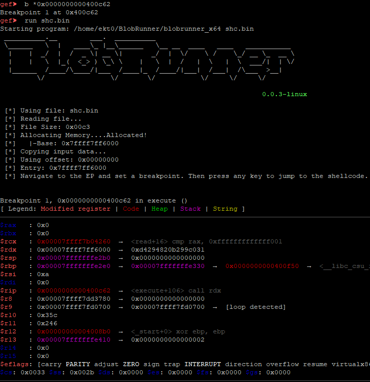

# BlobRunner 

BlobRunner is a simple tool to quickly debug shellcode extracted during malware analysis.  
BlobRunner allocates memory for the target file and jumps to the base (or offset) of the allocated memory. This allows
an analyst to quickly debug into extracted artifacts with minimal overhead and effort. 

Original tool is from OALabs: [BlobRunner](https://github.com/OALabs/BlobRunner). This is just a Linux fork.

## Building

`gcc -o blobrunner_x64 blobrunner.c`
`gcc -m32 -o blobrunner_x86 blobrunner.c`

